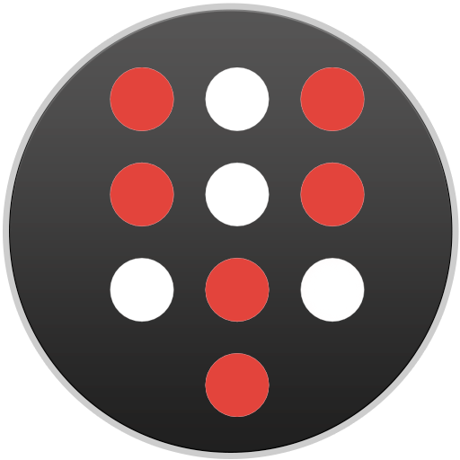

# ScreenDeck




ScreenDeck is a virtual on-screen stream deck for Bitfocus Companion, built with Electron and TypeScript. This application allows you to create a customizable keypad interface that can send button presses to Companion, enabling you to control various applications, and perform automated tasks, all from an easily accessible on-screen interface.

## Features

- **Customizable Keypad Layout**: Configure the total number of buttons and number per row.
- **Flexible Connectivity**: Easily set the IP and port for connecting to Bitfocus Companion through the settings menu.
- **Responsive UI**: Designed with a clean, modern interface that adjusts to your screen setup.

## How to Use ScreenDeck

1. **Download and Install**: Download the latest release here: https://github.com/josephdadams/screendeck/releases

1. **Run from Source**: Clone the repository and install dependencies using Yarn:

    ```bash
    git clone https://github.com/josephdadams/screendeck
    cd screendeck
    yarn
    yarn start
    ```

    Configure Your Settings: Open the settings window to set up the Companion IP, port, and keypad layout.
    Connect to Bitfocus Companion: Once configured, ScreenDeck will connect to your Companion setup and allow you to control your configured buttons.
    Assign Commands: Use Bitfocus Companion to map specific commands or actions to each button on the ScreenDeck interface.

## Contributing

Contributions are welcome! To contribute to the development of ScreenDeck:

1. Fork the Repository: Create a fork of the main repository to your GitHub account.
1. Create a Branch: Create a new branch for your feature or bug fix:

    ```bash
    git checkout -b feature-name
    ```

1. Make Changes: Implement your changes and test them thoroughly.
1. Submit a Pull Request: Once your changes are ready, submit a pull request to the main repository with a clear description of your changes.

## Development

To develop ScreenDeck, you will need to have Node.js and Yarn installed. Follow these steps to set up your development environment.

1. Clone the Repository:

    ```bash
    git clone https://github.com/josephdadams/screendeck
    cd ScreenDeck
    ```

1. Install Dependencies:

    ```bash
    yarn
    ```

1. Run the Application:

    ```bash
    yarn start
    ```

1. Build the Application:

    ```bash
    yarn build
    ```

1. Package the Application using electron-builder:

    ```
    yarn dist
    ```

## License

ScreenDeck is an open-source project licensed under the MIT License. Feel free to use, modify, and distribute this software as per the terms of the license.
Contact

For any questions or support, feel free to reach out through GitHub Issues.
